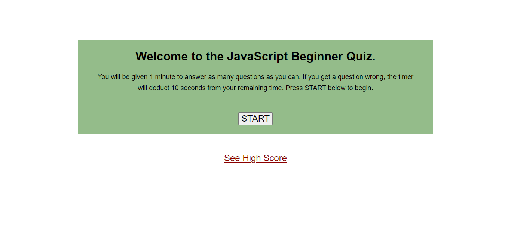

# 04-web-apis
Bootcamp Homework #4

## Objective

Created a Beginner JavaScript quiz that ask timed questions, deducts time for wrong answers, and allows user to set initials if they have reached the highest score. 

## Screen Shot

## Link to deployed page

[Here is the link to my deployed code.](https://ljhofer.github.io/04-web-apis/)
